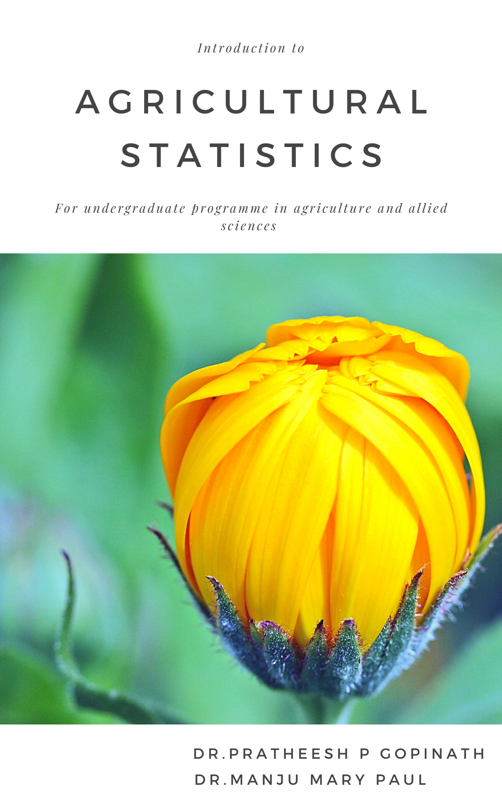

---
title: "INTRODUCTION TO AGRICULTURAL STATISTICS"
author: "Dr. Pratheesh P. Gopinath, Dr. Manju Mary Paul"
date: "2022-01-30"
site: bookdown::bookdown_site
documentclass: book
bibliography: [book.bib]
biblio-style: apalike
link-citations: yes
github-repo: https://github.com/pratheesh3780/Applied-statistical-genetics
description: "A BOOK FOR UNDERGRADUATE PROGRAMME IN AGRICULTURE"
cover-image: images/coverpage.PNG
---  
 

# Welcome {-} 
<p style="text-align: center;"><a href="https://coavellayani.kau.in/people/dr-pratheesh-p-gopinath"></a></p>  
Welcome to the book **Introduction to Agricultural Statistics**.

# Preface {-}  
<p style="text-align: justify;">Agriculture plays a vital role in the Indian economy. Over 70 per cent of the rural households depend on agriculture. To ensure food security to the growing population, active research is an inevitable part for developing procedures to increase livestock and crop yields, improve farmland productivity, reduce loss due to post harvest handling, manage disease and insects, develop more efficient equipment and to increase overall food quality. A lot of scientist and students are involved in this process. Surveys, field and lab experiments are an integral part of agricultural research. All these actions generate, what we call data, which need to be carefully examined, understood and visualized for making valid scientific interpretations and conclusions.</p>

<p style="text-align: justify;">Statistics, the science of collecting, analysing, presenting, and interpreting data plays an important role in agricultural research and survey. Knowledge in statistics helps you to use the proper methods to collect the data, employ the correct analyses, and effectively present the results. Statistics as a subject is very hard to learn, but if presented in a proper way, it is very fun and interesting. Majority of students and researchers in agriculture and allied sciences didn’t have a mathematical background, which makes it even harder for them to learn and understand the concepts. Students takes up this subject seriously for their post graduate and PhD programme, as it is very much required for their research work, usually they didn't get a chance to brush up the very basics they learned during their graduation. But remember you can't build a great building on a weak foundation.</p>  

<p style="text-align: justify;">Statistics is very much needed now, not only in the field of Agriculture, but in all other fields including medical research. Basic statistical concept remain same, but what changes with the field of study is the statistical tool employed. Before learning about statistical tools, to apply in your research the very basics and concepts in statistics should be made clear. There are no much books available, which discuss the very basics of statistics, for the students in agriculture and allied sciences. This motivates us to come up with a book that handles statistics with simplicity and lot of examples. We have tried to incorporate MCQs and subjective questions towards the end of each chapter to help the students to prepare for competitive examinations.</p>  

<p style="text-align: justify;"> **Note**: This book is published by XXXXXXXX. The online version of this book is free to read here.</p> 
````{=html}
<a rel="license" href="http://creativecommons.org/licenses/by-nc-nd/4.0/"></a><br />This work is licensed under a <a rel="license" href="http://creativecommons.org/licenses/by-nc-nd/4.0/">Creative Commons Attribution-NonCommercial-NoDerivatives 4.0 International License</a>.
````
<p style="text-align: justify;">If you have any feedback, please feel free to [file an issue on GitHub](https://github.com/pratheesh3780/basic-statistics). Thank you!</p>  

<p style="text-align: center;">This book is for under graduate programme in agriculture and other allied sciences </p>  


